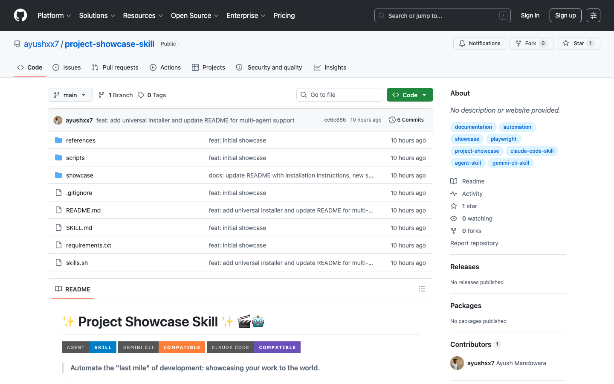
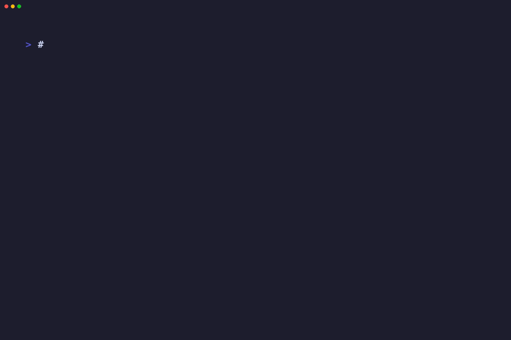

# Project Showcase Skill 🎬✨
**The Magic Pill for Shipping Professional Project Showcases**

[](https://github.com/google/gemini-cli)
[](https://github.com/anthropic/claude-code)
[](https://github.com/ayushxx7/project-showcase-skill)
[](https://opensource.org/licenses/MIT)

[](https://github.com/ayushxx7/project-showcase-skill)
[](showcase/cli_power_demo.gif)

**Project Showcase Skill** is the "magic pill" for developers who hate documentation but love showing off. Automate the "last mile" of your workflow—generating high-fidelity visual galleries and surgical README updates in seconds.

## 📦 Installation in 30 Seconds

### 1. Install the Skill
Add it to Gemini CLI, Claude Code, or any agent using the universal installer:
```bash
curl -sSL https://raw.githubusercontent.com/ayushxx7/project-showcase-skill/main/skills.sh | bash
```

### 2. Auto-Setup
The skill is self-configuring. On first trigger, it will autonomously set up **Playwright** and **VHS** for you. Or run it manually:
```bash
./scripts/setup.sh
```

## 🪄 How to Use

Once installed, just talk to your agent (Gemini or Claude) in the terminal. Try these "magic phrases":

- **For Web Apps**: *"Showcase this project. Start the server and capture the UI."*
- **For CLI Tools**: *"Record a terminal demo of my CLI tool and add it to the README."*
- **For Socials**: *"Write a LinkedIn post and an elevator pitch for this showcase."*
- **For Galleries**: *"Add a visual gallery to my existing README without overwriting my notes."*

## ✨ The Magic Features

### 🎬 Self-Healing Web Capture
- **Auto-Verification**: Detects 404s, blank screens, and hydration lag.
- **Smart Retries**: If the UI isn't ready, the skill waits, reloads, and fixes the capture autonomously.
- **Video Recording**: High-res `.webm` recordings of your browser interactions.

### 📟 Automated CLI Demos
- **VHS Integration**: Scripted terminal sessions that "type" themselves into high-fidelity GIFs.
- **Zero Effort**: Just tell the agent what commands to run; it generates the `.tape` and the GIF for you.

### 🛡️ Dev-First README Injection
- **Preserve & Merge**: It identifies your manual documentation and injects visual galleries around it.
- **UX Audit**: Automatically places high-conversion "Live App" badges at the very top.
- **Auto-Cleanup**: Generates the assets, updates the docs, and deletes the temporary scripts.

## 🎬 Showcase Gallery
| 🎬 Web Showcase | 📟 CLI Power Demo (GIF) |
| :---: | :---: |
|  |  |

## 🛠️ Tech Stack
- **Engine**: Python 3.x, Playwright (Browser Automation)
- **Terminal**: VHS (CLI Scripting)
- **Agent Protocol**: Universal Skill Schema (Gemini, Claude, Generic)
- **Design**: Shields.io for modern CTA badges

---
*Built with ❤️ for Vibe Coders everywhere. Stop documenting. Start showcasing.*
