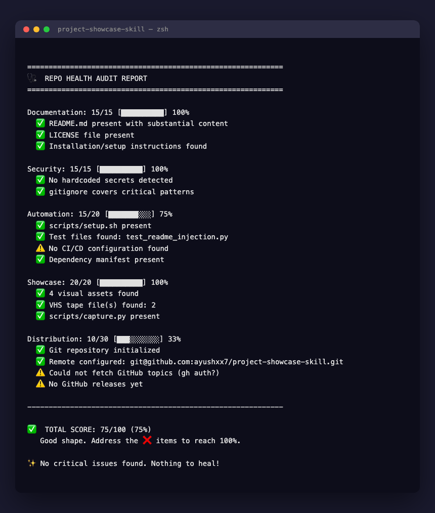
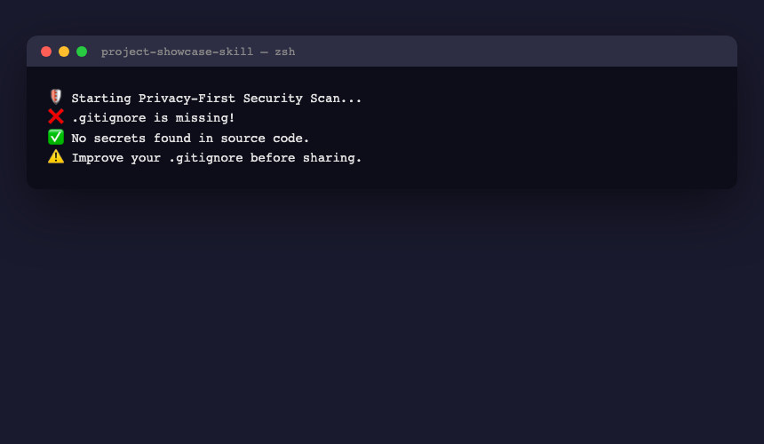

# Project Showcase Skill

**Automate the "last mile" of development** — visual galleries, security audits, README injection, and social media launches.

## 🎬 Showcase Gallery

| 📟 Demo GIF | 🩺 Health Audit | 🛡️ Security Scan |
|:---:|:---:|:---:|
|  |  |  |

## Quick Start

```bash
# Install the skill into your AI agent
curl -sSL https://raw.githubusercontent.com/ayushxx7/project-showcase-skill/main/skills.sh | bash

# Setup dependencies
./scripts/setup.sh

# Run the full showcase pipeline on a project
python3 scripts/scan.py --dir /path/to/project
python3 scripts/capture.py --url http://localhost:3000 --responsive
python3 scripts/audit.py --dir /path/to/project --heal
python3 scripts/inject_readme.py --readme README.md --gallery "## 🎬 Showcase Gallery\n"
python3 scripts/release.py --version v1.0.0
```

## Scripts

| Script | Purpose |
|---|---|
| `scripts/capture.py` | Playwright UI screenshots (desktop/tablet/mobile) |
| `scripts/scan.py` | Security scan for hardcoded secrets |
| `scripts/audit.py` | Repo health scoring (0-100) + healing plan |
| `scripts/inject_readme.py` | Surgical README gallery injection |
| `scripts/release.py` | GitHub release with auto-changelog |
| `scripts/manage_metadata.py` | GitHub topics + description auto-detection |
| `scripts/setup.sh` | One-shot dependency installer |

## Agent Usage

Once installed as a skill, tell your agent:

- *"Showcase this project"* — Full pipeline
- *"Audit this project"* — Health score + healing plan
- *"Capture the UI"* — Screenshots across viewports
- *"Scan for secrets"* — Pre-publish security check
- *"Update the README"* — Gallery injection
- *"Create a release"* — GitHub release with changelog
- *"Launch on LinkedIn"* — Post templates + asset bundling

## Docs

https://project-showcase-skill.readthedocs.io/

## License

MIT
